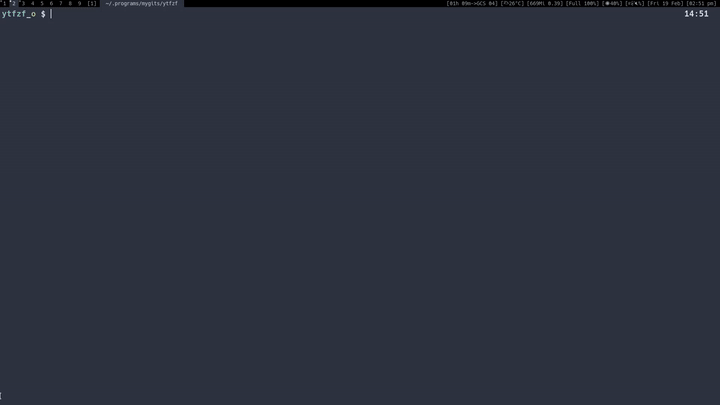

# ytfzf

A posix script that helps you find Youtube videos (with out API) and opens/downloads using mpv/youtube-dl.
* Thumbnails
* History support
* Download support
* Format selection (and default formats)
* Queue multiple tracks (using fzf multiselection)

Initially this used to be a single line script. But for portability and extensibility I am breaking my vow. If you still are here for the memes then use the line below. 

```sh
#!/bin/sh
[ -z "$*" ] || curl "https://www.youtube.com/results" -s -G --data-urlencode "search_query=$*" |  pup 'script' | grep  "^ *var ytInitialData" | sed 's/^[^=]*=//g;s/;$//' | jq '..|.videoRenderer?' | sed '/^null$/d' | jq '.title.runs[0].text,.longBylineText.runs[0].text,.shortViewCountText.simpleText,.lengthText.simpleText,.publishedTimeText.simpleText,.videoId'| sed 's/^"//;s/"$//;s/\\"//g' | sed -E -n "s/(.{60}).*/\1/;N;s/\n(.{30}).*/\n\1/;N;N;N;N;s/\n/\t|/g;p" | column -t  -s "$(printf "\t")" | fzf --delimiter='\|' --nth=1,2  | sed -E 's_.*\|([^|]*)$_https://www.youtube.com/watch?v=\1_' | xargs -r -I'{}' mpv {}
```

# Update log

- Now ytfzf can queue videos using fzf multiselect option. Press tab to select a video. All the videos will be lined up in mpv. Use `>` and `<` to traverse them.
- Make continuous queries with `-s`
- Thumbnails! Using Ueberzug. Inspired by [fontpreview-ueberzug](https://github.com/OliverLew/fontpreview-ueberzug).
- added MacOS support
- Stdin can be taken by using `ytfzf -`, for both fzf and external menu.

# Usage



```
Usage: ytfzf <search query>
     -h                    Show this help text
     -t                    Show thumbnails (requires ueberzug)
                           Doesn't work with -H -D
     -D                    Use external menu(default dmenu) instead of fzf
     -H                    Choose from history
     -x                    Delete history
     -m  <search query>    Audio only (for music)
     -d  <search query>    Download to current directory
     -f  <search query>    Show available formats before proceeding
     -a  <search query>    Auto play the first result, no selector
     -r  <search query>    Auto play a random result, no selector
	 -n  <link count>       To specify number of videos to select with -a or -r
     -l  <search query>    Loop: prompt selector again after video ends
     -s  <search query>    After the video ends make another search
     -L  <search query>    Prints the selected URL only, helpful for scripting
  Use - instead of <query> for stdin
```

* To use dmenu with a custom width

```sh
YTFZF_EXTMENU_LEN=250 ytfzf -D
```

* Videos can be selected using fzf, dmenu or rofi.

## Examples
> Watch to find videos (with out thumbnails)

	ytfzf <query>

> Watch to find videos with thumbnails

	ytfzf -t <query>
	
* You can use multiple options together, here are some examples

> Steam audio (music), and prompt as the music finishes

	ytfzf -ml <query>


> Download a video from your history

	ytfzf -dH

> Open using dmenu in a certain format

	ytfzf -fD  

If you started watching a video and you wish to change format then 
first hit Q to save position and quit mpv, then choose your format using

	ytfzf -faH


## Useful mpv key bindings
* Use `f` for full screen
* Use `J` for subtitles (also works with audio, if the music video has subtitles)
* Use `L` for single-loop

# Dependencies
* mpv
* [youtube-dl](https://github.com/ytdl-org/youtube-dl)
* [fzf](https://github.com/junegunn/fzf) (Optional) - for menu
* [jq](https://github.com/stedolan/jq) - to parse json
* [ueberzug](https://github.com/seebye/ueberzug) (Optional) - for thumbnails

> Fzf is optional, you can use external menu (like dmenu) with the `-D` option (no thumbnail support).
> Thumbnails only work with fzf and Ueberzug as of now.

### Arch based

	sudo pacman -S jq mpv youtube-dl fzf 

> For thumbnails 
	
	sudo pacman -S ueberzug

### Debian based

	sudo apt install jq mpv youtube-dl fzf 

> For thumbnails 

	pip install ueberzug

> Note youtube-dl is usually outdated in debian repos, I suggest getting it from 
	

* [youtube-dl github](https://github.com/ytdl-org/youtube-dl)

### MacOS

	brew install jq mpv youtube-dl fzf


# Installation

```sh
git clone https://github.com/pystardust/ytfzf
cd ytfzf
```

Install with the Makefile
	
```sh
sudo make install
```

Uninstall with the Makefile

```sh
sudo make uninstall
```

Arch users can install ytfzf from the [AUR](https://aur.archlinux.org/packages/ytfzf-git/)
	
	yay -S ytfzf-git
        

# Defaults

Defaults can be set by environmental variables.

> Environment variables can be set in many ways. You can add them to you ~/.bashrc if you don't want to mention them every time

For one time settings you can specify the variables as shown

```sh
YTFZF_HIST=0 YTFZF_PREF="bestvideo[height<=?1080]+bestaudio/best" ytfzf  <query>
```
> This will not include this video in your history and display it in a resolution no more than 1080p.

## Format

If you prefer to watch Youtube videos in certain option with out the prompting every single time.

```sh
export YTFZF_PREF="22"                   
```
[Documentation for ytdl formats](https://github.com/ytdl-org/youtube-dl#format-selection)

If the preferred format is not available then, it will go back to auto selection.


## History

On by default. If you don't want history.

```sh
export YTFZF_HIST=0
```
> 0: history off, 1: history on

* This history will be stored in the cache directory as `ytfzf_hst`

You can modify the file location by changing the cache directory

```sh
export YTFZF_CACHE=~/.cache/ytfzf
```


## Loop menu prompt

Off by default.  Can be turned on using option `-l`. Or setting

```sh
export YTFZF_LOOP=1
```

This would return you to the video selection prompt after the video is exited/ends.

> To quit the script you can press `ESC` or `^C` in the video selection prompt.

## External menu command (dmenu / rofi)

To use an external menu you will need to pass in the `-D` option
```sh
ytfzf -D
```

By default the external menu is set to dmenu `dmenu -i -l 30`. You can modify to this to rofy by

```sh
export YTFZF_EXTMENU=' rofi -dmenu -fuzzy -width 1500'
```
> I don't use rofi much, I would love to hear from any rofi user on better defaults.

You also may need to modify the width of the output that is being piped into external menu.
 Depending on you screen resolution and font size this may need to be modified.
```sh
export YTFZF_EXTMENU_LEN=180
```
or
```sh
YTFZF_EXTMENU_LEN=180 ytfzf -D
```

> WARNING : dmenu doesn't behave well with some fonts. Expect it to be slow with fonts you don't have.


## Currently Playing

On by default. Stores the details of the currently playing track. Empty when nothing is playing. This could be used in status bar modules.
To disable it
```sh
export YTFZF_CUR=0
```

It will be stored in the ytfzf cache directory as `ytfzf_cur`


## Custom Player
By default, ytfzf uses `mpv`. custom player should have the ability to launch youtube links.

``` sh
# example: using devour
export FZF_PLAYER="devour mpv"
export YTFZF_PLAYER_FORMAT="devour mpv --ytdl-format="
```

# Todo

* [ ] Playlists
* [ ] Comments
* [x] Icons

## Bugs

* dwm with swallow patch: Images don't render when looped (ie, option -l)
