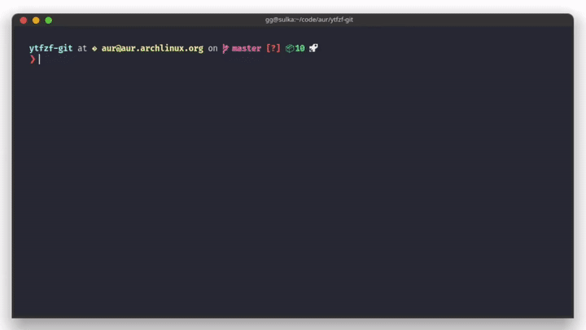

<p align="center">
    <a> </a>
    <br />
    <br />
    <i>A posix script that helps you find Youtube video (without API) and opnes/downloads using mpv/youtube-dl</i> 
	<hr>
</p>

<p align="center">
	<i>Initially this used to be a single line script. But for portability and extensibility I am breaking my vow. If you still are here for the memes then use the line below.</i>
</p>


```sh
#!/bin/sh
[ -z "$*" ] || curl "https://www.youtube.com/results" -s -G --data-urlencode "search_query=$*" |  pup 'script' | grep  "^ *var ytInitialData" | sed 's/^[^=]*=//g;s/;$//' | jq '..|.videoRenderer?' | sed '/^null$/d' | jq '.title.runs[0].text,.longBylineText.runs[0].text,.shortViewCountText.simpleText,.lengthText.simpleText,.publishedTimeText.simpleText,.videoId'| sed 's/^"//;s/"$//;s/\\"//g' | sed -E -n "s/(.{60}).*/\1/;N;s/\n(.{30}).*/\n\1/;N;N;N;N;s/\n/\t|/g;p" | column -t  -s "$(printf "\t")" | fzf --delimiter='\|' --nth=1,2  | sed -E 's_.*\|([^|]*)$_https://www.youtube.com/watch?v=\1_' | xargs -r -I'{}' mpv {}
```

## Table of content 

- [`Usege instruction`](#Usage-Instructions)
- [`Features`](#Features)
- [`Examples`](#Examples)
- [`Dependencies`](#Dependencies)
- [`Installation`](#Installation)
- [`Configuration`](#Configuration)
- [`External menu command (dmenu / rofi)`](#External-menu-command)

### This is a little showcase



## Usage-Instructions

```
Basic Usage: ytfzf [OPTIONS] <search-query>
  OPTIONS:
     -h, --help                           Show this help text
     -t, --thumbnails                     Show thumbnails (requires ueberzug)
                                          Doesn't work with -H -D
     -D, --ext-menu                       Use external menu(default dmenu) instead of fzf 
     -H, --choose-from-history            Choose from history 
     -x, --clear-history                  Delete history
     -m, --audio-only   <search-query>    Audio only (for music)
     -d, --download     <search-query>    Download to current directory
     -f                 <search-query>    Show available formats before proceeding
     -a, --auto-play    <search-query>    Auto play the first result, no selector
     -r  --random-play  <search-query>    Auto play a random result, no selector
     -n, --video-count= <video-count>     To specify number of videos to select with -a or -r
     -l, --loop         <search-query>    Loop: prompt selector again after video ends
     -s                 <search-query>    After the video ends make another search 
     -L, --link-only    <search-query>    Prints the selected URL only, helpful for scripting
  Use - instead of <search-query> for stdin
```
> To quit the script you can press `ESC` or `^C` in the video selection prompt.

_**To use dmenu with a custom width**_

```sh
YTFZF_EXTMENU_LEN=250 ytfzf -D
```

_Videos can be selected using fzf, dmenu or rofi._

## Features

* Thumbnails
* History support
* Download support
* Format selection (and default formats)
* Queue multiple tracks (using fzf multiselection)


## Examples

+  Search with Thumbnails 

	> Find and watch videos with thumbnails preview 

       ytfzf -t <query>

+  Search without Thumbnails 

	> Find and watch videos without thumbnails preview (good if are on MacOS for example)

	   ytfzf <query>

+  You can use multiple options together, here are some examples

	- Steam audio (music), and prompt as the music finishes

		  ytfzf -ml <query>

	- Download a video from your history

	      ytfzf -dH

	- Open using dmenu in a certain format

	 	  ytfzf -fD  

+ _If you started watching a video and you wish to change format then 
first hit Q to save position and quit mpv, then choose your format using_

	  ytfzf -faH


### Useful mpv key bindings

* Use `f` for full screen
* Use `J` for subtitles (also works with audio, if the music video has subtitles)
* Use `L` for single-loop

### Update log

- Now ytfzf can queue videos using fzf multiselect option. Press tab to select a video. All the videos will be lined up in mpv. Use `>` and `<` to traverse them.
- Make continuous queries with `-s`
- Thumbnails! Using Ueberzug. Inspired by [`fontpreview-ueberzug`](https://github.com/OliverLew/fontpreview-ueberzug).
- added MacOS support
- Stdin can be taken by using `ytfzf -`, for both fzf and external menu.

## Dependencies

_Fzf is optional, you can use external menu (like dmenu) with the `-D` option (no thumbnail support)._

* [`mpv`](https://github.com/mpv-player/mpv)
* [`youtube-dl`](https://github.com/ytdl-org/youtube-dl)
* [`fzf`](https://github.com/junegunn/fzf) (Optional) - _for menu_
* [`jq`](https://github.com/stedolan/jq) - _to parse json_
* [`ueberzug`](https://github.com/seebye/ueberzug) (Optional) - _for thumbnails_

> Thumbnails only work with fzf and Ueberzug as of now.


+ ### Arch based

	  sudo pacman -S jq mpv youtube-dl fzf 

	> For thumbnails 
	
	  sudo pacman -S ueberzug

+ ### Debian based

	  sudo apt install jq mpv youtube-dl fzf 

	> For thumbnails 

	  pip install ueberzug

	_Note youtube-dl is usually outdated in debian repos, I suggest getting it from  [youtube-dl github](https://github.com/ytdl-org/youtube-dl)_

+ ### MacOS

	  brew install jq mpv youtube-dl fzf

	_As of now thoumbnails preview doesn't work_


## Installation

+ #### Cloning the repository

	```sh
	git clone https://github.com/pystardust/ytfzf
	cd ytfzf
	```

	- ##### Install with the Makefile
		
		```sh
		sudo make install
		```

	- ##### Uninstall with the Makefile
	
		```sh
		sudo make uninstall
		```
	
+ #### Arch users can install ytfzf from the [AUR](https://aur.archlinux.org/packages/ytfzf-git/)
		
		yay -S ytfzf-git
        	
	
## Configuration

_Default configuration can be set in the configuration file `~/.config/ytfzf/conf.sh` or with environment variables._

+ ##### Defaults can be set in `~/.config/ytfzf/conf.sh`
	```sh
	YTFZF_HIST=0 # history is on by default it can be set to -> 0 history off, 1: history on
	YTFZF_LOOP=1 # if set to 1 it is on but normally it is off by default. Can be turned on using option -l
	YTFZF_PREF="bestvideo[height<=?1080]+bestaudio/best"
	YTFZF_ENABLE_FZF_DEFAULT_OPTS=1 # fzf colors are going to be the one from your fzf configuration
	```

+ ##### Or export them in your shell config

	```sh
	export YTFZF_HIST=0 # history is on by default it can be set to -> 0 history off, 1: history on
	export YTFZF_LOOP=1 # if set to 1 it is on but normally it is off by default. Can be turned on using option -l
	export YTFZF_PREF="bestvideo[height<=?1080]+bestaudio/best"
	export YTFZF_ENABLE_FZF_DEFAULT_OPTS=1 # fzf colors are going to be the one from your fzf configuration
	```

+ ##### One time settings can be specify as showed here

	```sh
	YTFZF_HIST=0 YTFZF_PREF="bestvideo[height<=?1080]+bestaudio/best" ytfzf  <query>
	```
	- _The setting in the config will always override environment variables. This command wouldn't function as expected if_ `YTFZF_HIST=1` _was mentioned in the config file._

	- _This will not include this video in your history and display it in a resolution no more than 1080p._

+ ##### This history will be stored in the cache directory as `ytfzf_hst`

	```sh
	YTFZF_CACHE=~/.cache/ytfzf
	```

	_You can modify the file location by changing the cache directory_

+ ##### Format

	_If you prefer to watch Youtube videos in certain option without the prompting every single time you can use the following setting.

	```sh
	YTFZF_PREF="22"                   
	```

	_If the preferred format is not available then, it will go back to auto selection._ [_Documentation for ytdl formats_](https://github.com/ytdl-org/youtube-dl#format-selection)

## External-menu command 
	
_The currently supported one are (dmenu / rofi)_

+ ##### To use an external menu you will need to pass in the `-D` option
	```sh
	ytfzf -D
	```
	_By default the external menu is set to dmenu `dmenu -i -l 30`. You can modify to this to rofy by_

	```sh
	YTFZF_EXTMENU=' rofi -dmenu -fuzzy -width 1500'
	```

	> I don't use rofi much, I would love to hear from any rofi user on better defaults.

+ ##### You also may need to modify the width of the output that is being piped into external menu.
	_Depending on you screen resolution and font size this may need to be modified._

  - **First option**
	
	```sh
	YTFZF_EXTMENU_LEN=180
	```
	
  - **Second option**
	
	```sh
	YTFZF_EXTMENU_LEN=180 ytfzf -D
	```

> WARNING : dmenu doesn't behave well with some fonts. Expect it to be slow with fonts you don't have.

### Currently Playing

_`YTFZF` is `on` by default. Stores the details of the currently playing track. Empty when nothing is playing. This could be used in status bar modules._

+ ##### This will allow you to disable it

	```sh
	YTFZF_CUR=0
	```

	> It will be stored in the ytfzf cache directory as `ytfzf_cur`

### Custom Player

_By default, ytfzf uses `mpv`. Custom player should have the ability to launch youtube links._

``` sh
# example: using devour
FZF_PLAYER="devour mpv"
YTFZF_PLAYER_FORMAT="devour mpv --ytdl-format="
```

## Todo 📝

* [ ] Playlists
* [ ] Comments
* [x] Icons

## Bugs ❌

* _dwm with swallow patch: Images don't render when looped (ie, option -l)_
